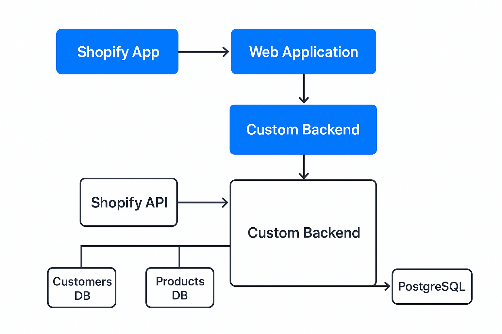

# Xeno-Shopify

This project is a Shopify Ingestion App that connects to a Shopify store, fetches orders, products, and customers, and stores them in a PostgreSQL database.
It provides REST APIs to ingest and query this data.
⚙️ Setup Instructions
1. Clone the Repository
git clone https://github.com/Pujitha147/shopify-app.git
cd shopify-app/shopify-backend

2. Install Dependencies
npm install

3. Environment Variables

Create a .env file in the backend root:

PORT=5000

# PostgreSQL Config
DB_HOST=postgres.railway.internal
DB_PORT=5432
DB_USER=postgres
DB_PASS=your_database_password
DB_NAME=railway

# JWT Secret
JWT_SECRET=supersecretkey123

# Shopify Config
SHOPIFY_ACCESS_TOKEN=your_shopify_token
SHOPIFY_STORE_DOMAIN=your-store.myshopify.com

4. Start the Server
npm run dev

The backend will run at:

http://localhost:5000
## 🏗️ Architecture Diagram

📡 API Endpoints
Orders

Ingest Orders
POST /api/ingest/orders
Fetch orders from Shopify and insert into DB.

Get Orders
GET /api/orders

Products

Ingest Products
POST /api/ingest/products
Fetch products from Shopify and insert into DB.

Get Products
GET /api/products

Customers

Ingest Customers
POST /api/ingest/customers
Fetch customers from Shopify and insert into DB.

Get Customers
GET /api/customers

🗄️ Database Schema
Orders
orders (
  id SERIAL PRIMARY KEY,
  shopify_order_id BIGINT UNIQUE,
  customer_id BIGINT,
  total_price DECIMAL,
  currency VARCHAR(10),
  status VARCHAR(50),
  created_at TIMESTAMP,
  updated_at TIMESTAMP
);

Products
products (
  id SERIAL PRIMARY KEY,
  shopify_product_id BIGINT UNIQUE,
  title VARCHAR(255),
  price DECIMAL,
  inventory_quantity INT,
  created_at TIMESTAMP,
  updated_at TIMESTAMP
);

Customers
customers (
  id SERIAL PRIMARY KEY,
  shopify_customer_id BIGINT UNIQUE,
  first_name VARCHAR(100),
  last_name VARCHAR(100),
  email VARCHAR(255) UNIQUE,
  created_at TIMESTAMP,
  updated_at TIMESTAMP
);

🚧 Known Limitations / Assumptions

Only basic fields from Shopify entities are stored. (Extendable for more fields.)

Assumes a single Shopify store per deployment.

No pagination handling yet for very large datasets.

Authentication is JWT-based, but role-based access control is not implemented.

DB migrations must be handled manually before production.

https://docs.google.com/document/d/1shUe_b3kaqtKRz2urC4-HHiD6idF0A2dT-COlEDnGJM/edit?usp=sharing
